# 세부기능
 

## 1. 사용자 검색
 
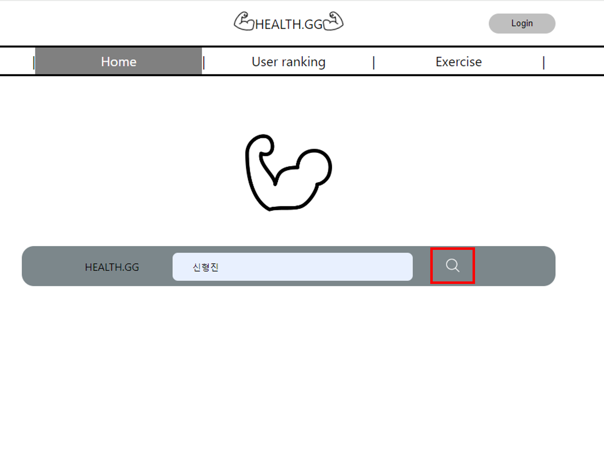

 메인페이지에서 닉네임으로 검색      
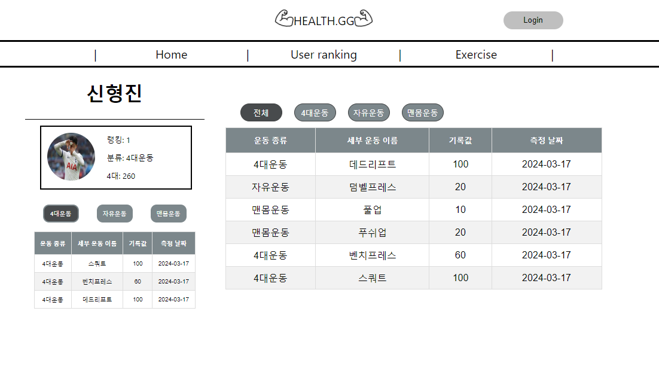

 존재하는 닉네임일 경우 사용자의 프로필과 랭킹, 각 운동별 최고 기록, 운동 기록을 확인할 수 있다.      

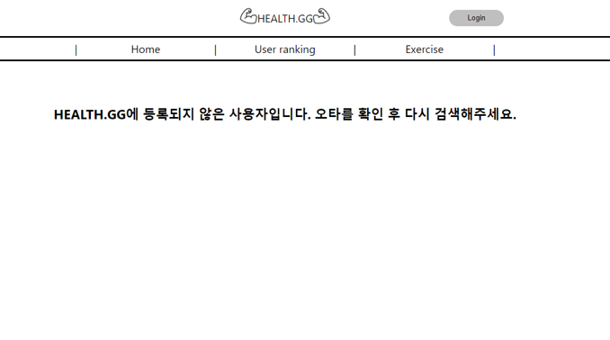

 만약, 사용자가 존재하지 않을 경우 등록되지 않은 사용자를 알려주는 페이지 반환      

## 2. 사용자 랭킹 시스템

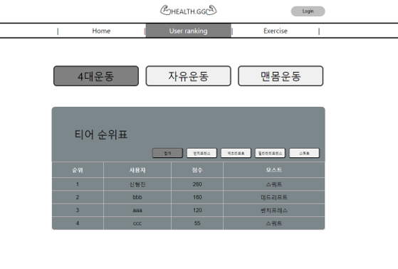

 User ranking 탭으로 들어가면 각 카테고리별, 세부 운동별 랭킹을 볼 수 있다      

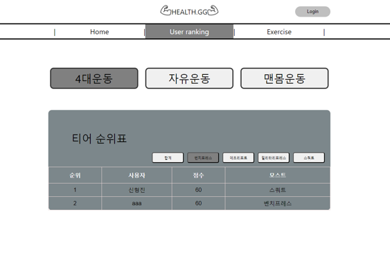

 이때 가장 기록이 좋은 운동은 모스트로 등록된다.     

## 3. 로그인 기능

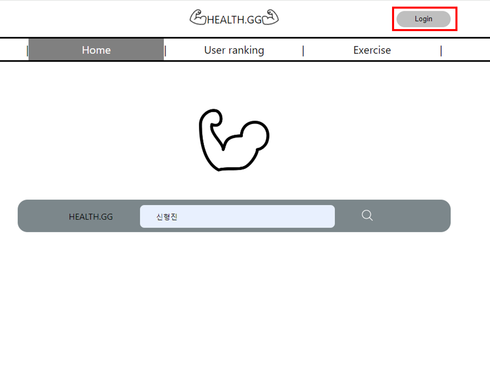

 우측 상단 로그인 버튼 클릭     

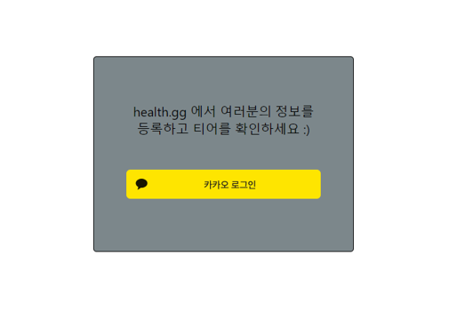

 카카오 로그인 API로 로그인 할 수 있다.     

## 4. 개인정보 수정

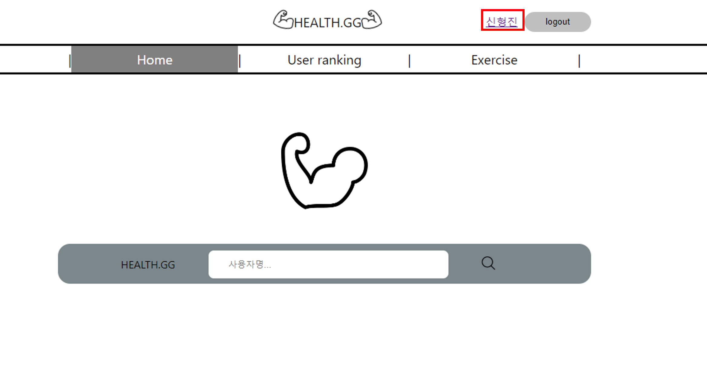

 우측 상단에서 마이페이지에 들어갈 수 있다.     

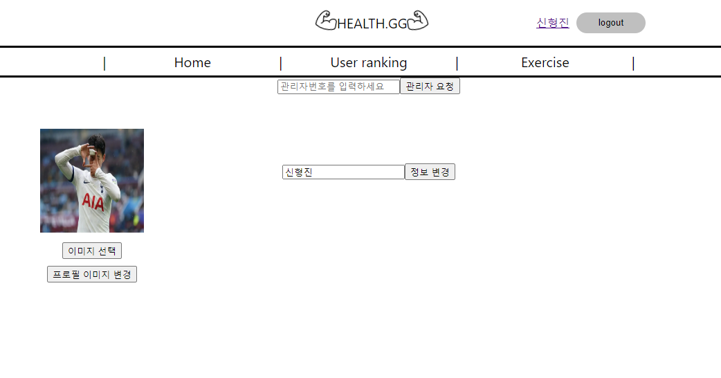

 닉네임 및 프로필 이미지를 변경할 수 있다.     

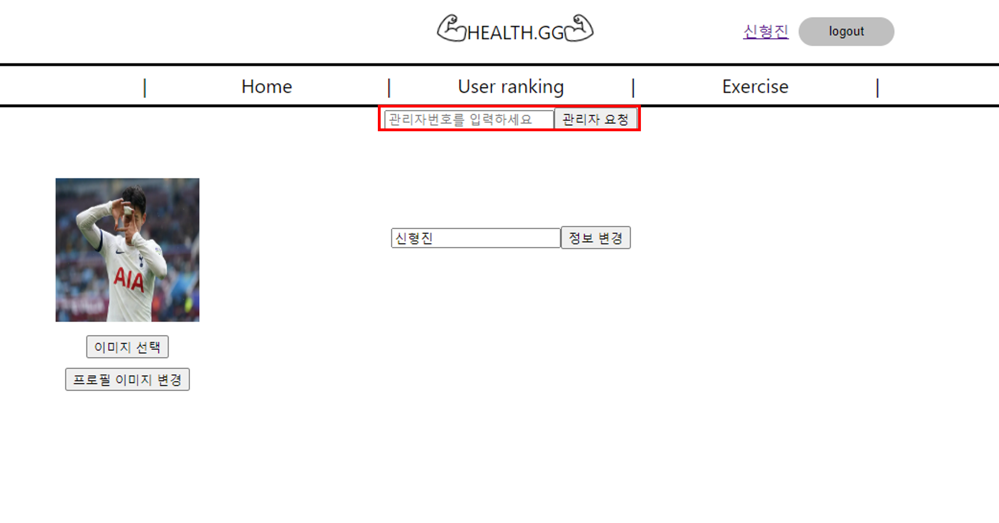

  관리자 비밀번호를 통해 관리자 권한을 요청할 수 있다. (관리자 비밀번호: admin_0000)    

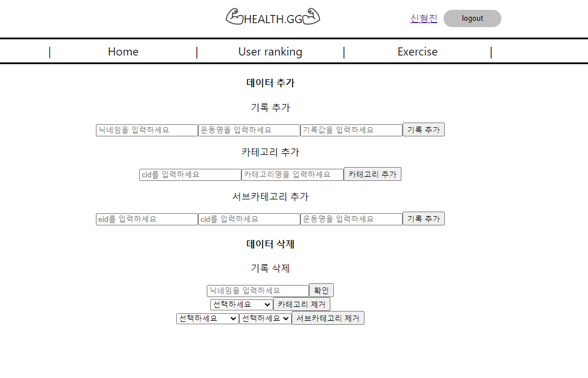

 만약 관리자 권한을 갖는다면 기록 및 카테고리, 세부운동을 추가 삭제할 수 있다.     