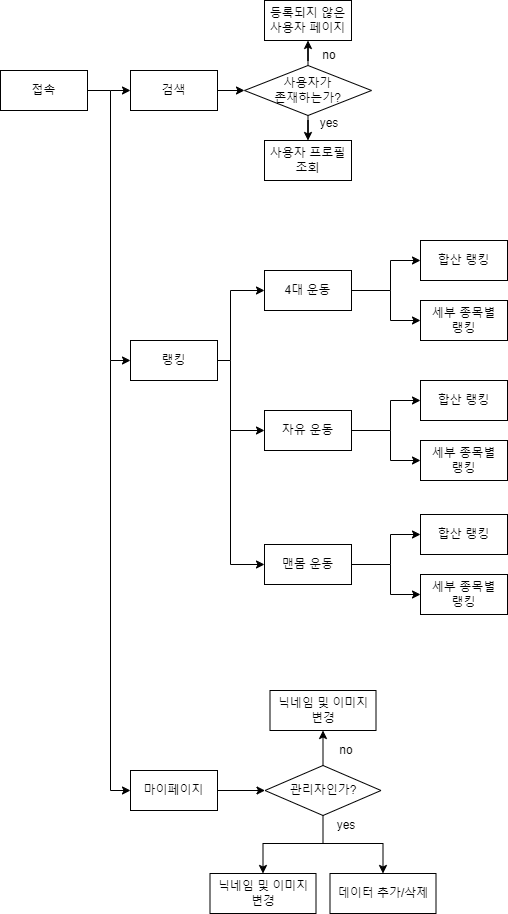

<h1>HEALTHGG</h1>

 React.js와 Springboot Framework를 이용한 운동 기록 관리 웹 프로젝트

 ### 홈페이지 URL
 [https://white-sea-097a0c500.5.azurestaticapps.net](https://white-sea-097a0c500.5.azurestaticapps.net)

 ### 목적
 * 운동을 기록하여 루틴 관리
 * 다른 사용자의 기록 및 랭킹으로 동기부여

### 일정
* 23.07.29 ~ 23.09.06

### 인원
* FE 2인(오창호, 차준규), BE(신형진) 1인 총 3인 팀 프로젝트

### 기능
[세부 기능 보기](DETAILFUNCTION.md)
 
 

## 개발 환경
* IDE: IntelliJ (Springboot), VScode (React.js)
* JAVA: 8
* SpringBoot: 2.7.14
* React.js: v18.16.1
* MySQL: 8.0.x

 
 

## 기술 스택
### Frontend
* React.js

### Backend
* SpringBoot 
* Spring Data JPA
* Azure Database for MySQL

 
 

## Flow Chart
 
 

 
 

## API
 

| 종류 | Endpoint | Description | Header | Request payload |
|------|---------|-------------------------| ---------|------|
| Search API | GET  /api/search | 유저 프로필 검색  | | - userNm: String |
| | GET   /api/search/record | 유저의 모든 운동기록 요청 | | - userNm: String   - category: String |
| | GET  /api/search/pbr | 유저의 개인 최고기록 요청 ||  - userNm: String   - category: String |
| Ranking API| GET  /api/user-ranking | 카테고리별 유저 랭킹 요청 | | - category: String   - subcategory: String |
| Profile API | PUT /api/profile | 본인의 닉네임 변경 | Authorization: ${access_token} | - category: String   - nickname: String |
| | GET  /api/profile | 개인정보 불러오기 | - Authorization: ${access_token} | |
| | POST   /api/auth | 관리자 권한 요청 | - Authorization: ${access_token} | - Passwd: String |
| | POST  /api/image | 프로필 이미지 변경 | - Authorization: ${access_token} | - file: MultipartFile  |
| Data API | PUT   /api/record | 사용자 운동기록 업데이트 {닉네임, 운동명, 중량or횟수, 위치} | - Authorization: ${access_token} | - nickname: String   - exerciseName: String   - value: Float   - location: String  |
|  | PUT  /api/category | 운동 카테고리(ex.4대운동) 업데이트 {카테고리식별자, 카테고리이름} | - Authorization: ${access_token} | - cid: String   - categoryName: String|
|  | PUT  /api/subcategory | 세부운동(ex.스쿼트) 업데이트 {세부운동식별자, 카테고리식별자, 세부운동이름} | - Authorization: ${access_token} | - eid: String   - cid: String   - exerciseName: String|
|  | DELETE   /api/record | 운동 기록 삭제 | - Authorization: ${access_token} | - rid: String|
|  | DELETE   /api/category | 운동 카테고리 삭제 | - Authorization: ${access_token} | - cid: String|
|  | DELETE  /api/subcategory | 세부운동 삭제 | - Authorization: ${access_token} | - eid: String|
| Login API | GET   /auth/kakao/callback | 로그인 요청 |  | - code: String|
| Logout API | GET   /auth/kakao/logout | 로그아웃 요청 | - Authorization: ${access_token} ||

## 개선하고 싶은 부분
1. 단일책임 원칙에 따라 하나의 Class가 하나의 역할만 할 수 있게 Service와 Repository의 구조 변경
2. table 구조 설계와 index 사용법을 숙지하여 table 구조 효율화 및 index 생성
